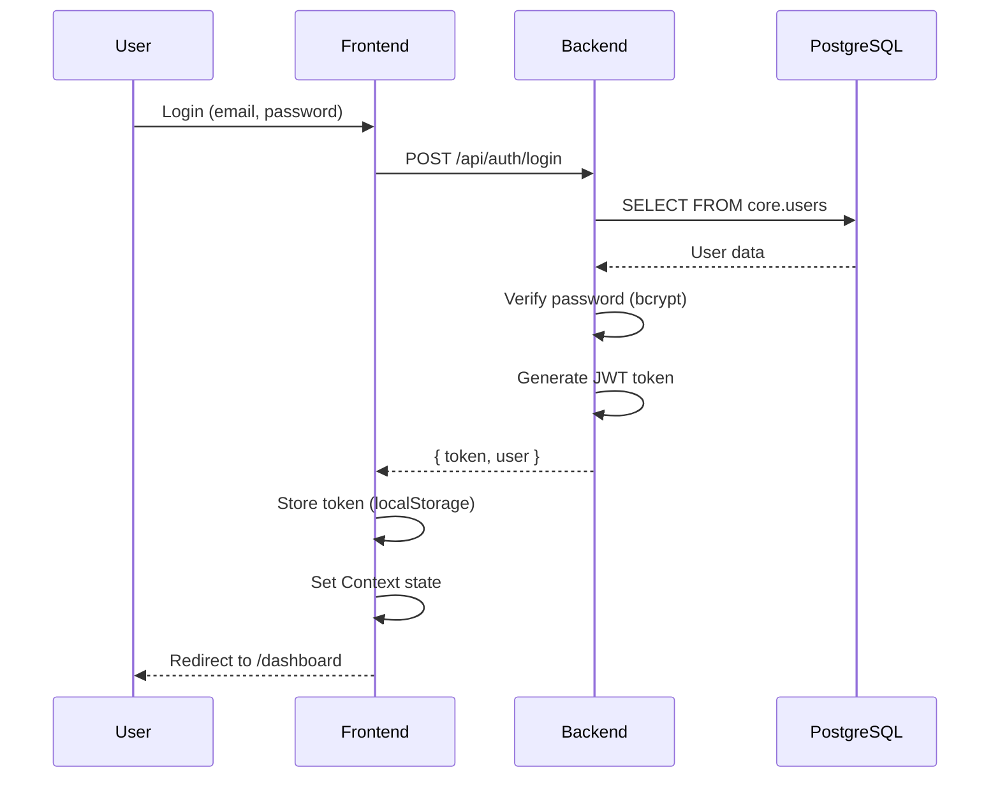

# 🎨 Frontend Development Guide

> **Mevcut frontend (`HzmFrontendVeriTabani/`) ve Generic Table Pattern'e geçiş rehberi**

[Ana Sayfa](../README.md)

---

## 📋 İçindekiler

1. [Mevcut Frontend Özellikleri](#mevcut-frontend-özellikleri)
2. [Tech Stack](#tech-stack)
3. [Proje Yapısı](#proje-yapısı)
4. [Generic Pattern'e Geçiş](#generic-patterne-geçiş)
5. [API Integration](#api-integration)
6. [State Management](#state-management)
7. [Authentication Flow](#authentication-flow)
8. [🔓 Storage Independence](#storage-independence) ⭐ **YENİ!**
9. [🚧 Placeholder UI Strategy](#placeholder-ui-strategy) ⭐ **YENİ!**

---

## 🎯 Yeni Modüller

### 🔓 Storage Independence
**[02_Storage_Independence.md](./02_Storage_Independence.md)**

Frontend'i **localStorage'a bağımlı olmaktan kurtarır**:
- ✅ Storage Adapter Pattern (5 adapter)
- ✅ LocalStorage → IndexedDB → API → Memory
- ✅ SSR Ready (server-side rendering)
- ✅ React Native Ready (AsyncStorage)
- ✅ Encryption support (sensitive data)
- ✅ Migration utility (smooth transition)

### 🚧 Placeholder UI Strategy
**[03_Placeholder_UI_Strategy.md](./03_Placeholder_UI_Strategy.md)**

Henüz hazır olmayan özellikler için **profesyonel UI**:
- ✅ FeatureComingSoon component
- ✅ PlaceholderButton component
- ✅ PlaceholderCard component
- ✅ Feature status system (planned → in-progress → ready)
- ✅ Progress tracking (0-100%)
- ✅ useFeature hook

---

## Mevcut Frontend Özellikleri

**Konum:** `HzmFrontendVeriTabani/`  
**Versiyon:** v1.1.1  
**Durum:** ⚠️ ESKİ MİMARİYE GÖRE (fiziksel tablo varsayımı)

### Mevcut Özellikler

✅ **Kullanıcı Yönetimi**
- Login / Register
- Email verification
- Password reset
- Profile management

✅ **Proje Yönetimi**
- Proje oluşturma
- Proje listesi
- Proje silme

✅ **Dinamik Tablo Oluşturucu**
- Sürükle-bırak interface (@dnd-kit)
- Field type seçimi (string, number, date, boolean, etc.)
- Validation rules
- Default values

✅ **CRUD Operasyonlar**
- Create records
- Read records (list + detail)
- Update records
- Delete records

✅ **API Key Yönetimi**
- API key oluşturma
- API key listesi
- API key silme

✅ **Responsive Tasarım**
- Mobile-friendly
- TailwindCSS utilities

✅ **Çoklu Dil (i18next)**
- Türkçe / İngilizce
- Language switcher

---

## Tech Stack

```json
{
  "name": "hzm-frontend",
  "version": "1.1.1",
  "dependencies": {
    "react": "^18.2.0",
    "react-dom": "^18.2.0",
    "react-router-dom": "^6.8.0",
    "axios": "^1.3.3",
    "i18next": "^22.4.9",
    "react-i18next": "^12.1.4",
    "@dnd-kit/core": "^6.0.7",
    "@dnd-kit/sortable": "^7.0.2",
    "react-hot-toast": "^2.4.0"
  },
  "devDependencies": {
    "vite": "^4.0.0",
    "tailwindcss": "^3.0.0",
    "typescript": "^4.9.4"
  }
}
```

### Önemli Kütüphaneler

| Library | Amaç | Alternatif |
|---------|------|------------|
| **Vite** | Build tool | Webpack, Parcel |
| **React Router v6** | Routing | Next.js, TanStack Router |
| **Axios** | HTTP client | Fetch API, SWR, React Query |
| **Context API** | State management | Redux, Zustand, Jotai |
| **TailwindCSS** | Styling | Styled-components, CSS Modules |
| **i18next** | Internationalization | react-intl, FormatJS |
| **@dnd-kit** | Drag & Drop | react-beautiful-dnd, react-dnd |

---

## Proje Yapısı

```
HzmFrontendVeriTabani/
├── public/
│   └── index.html
├── src/
│   ├── components/
│   │   ├── Auth/
│   │   │   ├── Login.tsx
│   │   │   ├── Register.tsx
│   │   │   └── ForgotPassword.tsx
│   │   ├── Projects/
│   │   │   ├── ProjectList.tsx
│   │   │   ├── ProjectCreate.tsx
│   │   │   └── ProjectDetail.tsx
│   │   ├── Tables/
│   │   │   ├── TableBuilder.tsx         ⚠️ ESKİ (fiziksel tablo oluşturur)
│   │   │   ├── TableList.tsx
│   │   │   └── FieldSelector.tsx
│   │   ├── Records/
│   │   │   ├── RecordList.tsx
│   │   │   ├── RecordCreate.tsx
│   │   │   └── RecordEdit.tsx
│   │   └── Common/
│   │       ├── Navbar.tsx
│   │       ├── Sidebar.tsx
│   │       └── Toast.tsx
│   ├── context/
│   │   ├── AuthContext.tsx              ✅ Auth state
│   │   ├── ProjectContext.tsx           ✅ Current project
│   │   └── ThemeContext.tsx
│   ├── hooks/
│   │   ├── useAuth.ts
│   │   ├── useApi.ts
│   │   └── useLocalStorage.ts
│   ├── services/
│   │   ├── api.ts                       ⚠️ Backend API calls (güncellenmeli)
│   │   ├── auth.service.ts
│   │   ├── project.service.ts
│   │   └── table.service.ts             ⚠️ ESKİ (fiziksel tablo API)
│   ├── types/
│   │   ├── auth.types.ts
│   │   ├── project.types.ts
│   │   └── table.types.ts
│   ├── utils/
│   │   ├── validators.ts
│   │   ├── formatters.ts
│   │   └── constants.ts
│   ├── i18n/
│   │   ├── en.json
│   │   └── tr.json
│   ├── App.tsx
│   ├── main.tsx
│   └── index.css
├── package.json
├── tsconfig.json
├── tailwind.config.js
├── vite.config.ts
└── README.md
```

---

## Generic Pattern'e Geçiş

### ⚠️ SORUN: Mevcut Frontend ESKİ Mimariyi Kullanıyor

**Eski Mimari (❌):**
```typescript
// src/services/table.service.ts (ESKİ)
export const createTable = async (projectId: number, tableName: string, fields: Field[]) => {
  // Backend'de fiziksel PostgreSQL tablosu oluşturur!
  const response = await api.post(`/api/projects/${projectId}/tables`, {
    table_name: tableName,
    fields: fields
  });
  return response.data;
};

export const addRecord = async (projectId: number, tableName: string, data: any) => {
  // Fiziksel tabloya INSERT yapar
  const response = await api.post(`/api/projects/${projectId}/tables/${tableName}/records`, data);
  return response.data;
};
```

**Yeni Mimari (✅ Generic Pattern):**
```typescript
// src/services/table.service.ts (YENİ)
export const createTable = async (projectId: number, tableName: string, fields: Field[]) => {
  // Sadece metadata oluşturur (fiziksel tablo OLUŞTURULMAZ!)
  const response = await api.post(`/api/projects/${projectId}/tables/metadata`, {
    table_name: tableName,
    fields: fields
  });
  return response.data;
};

export const addRecord = async (projectId: number, tableId: number, data: any) => {
  // app.generic_data'ya JSONB olarak ekler
  const response = await api.post(`/api/generic-data`, {
    table_id: tableId,
    data: data  // JSONB
  });
  return response.data;
};
```

### Değişmesi Gereken Dosyalar

**1. `src/services/table.service.ts`**

```diff
// ESKİ
- POST /api/projects/:projectId/tables/:tableName/records
+ POST /api/generic-data

// ESKİ
- GET /api/projects/:projectId/tables/:tableName/records
+ GET /api/generic-data?table_id=123

// ESKİ
- PUT /api/projects/:projectId/tables/:tableName/records/:id
+ PUT /api/generic-data/:id

// ESKİ
- DELETE /api/projects/:projectId/tables/:tableName/records/:id
+ DELETE /api/generic-data/:id
```

**2. `src/components/Records/RecordList.tsx`**

```diff
// ESKİ
- const { data } = await tableService.getRecords(projectId, tableName);
+ const { data } = await genericDataService.getRecords(tableId);
```

**3. `src/types/table.types.ts`**

```typescript
// YENİ
export interface GenericData {
  id: number;
  tenant_id: number;
  project_id: number;
  table_id: number;
  data: Record<string, any>;  // JSONB
  created_at: string;
  updated_at: string;
}
```

### Migration Steps (Frontend)

**Step 1: Yeni service oluştur**

```bash
touch src/services/generic-data.service.ts
```

```typescript
// src/services/generic-data.service.ts
import api from './api';

export const genericDataService = {
  // Create record
  async create(tableId: number, data: Record<string, any>) {
    const response = await api.post('/api/generic-data', {
      table_id: tableId,
      data: data
    });
    return response.data;
  },

  // Get records
  async getAll(tableId: number, filters?: any) {
    const response = await api.get('/api/generic-data', {
      params: { table_id: tableId, ...filters }
    });
    return response.data;
  },

  // Get single record
  async getById(id: number) {
    const response = await api.get(`/api/generic-data/${id}`);
    return response.data;
  },

  // Update record
  async update(id: number, data: Record<string, any>) {
    const response = await api.put(`/api/generic-data/${id}`, {
      data: data
    });
    return response.data;
  },

  // Delete record
  async delete(id: number) {
    const response = await api.delete(`/api/generic-data/${id}`);
    return response.data;
  }
};
```

**Step 2: Mevcut component'leri güncelle**

```typescript
// src/components/Records/RecordList.tsx (ÖNCE)
import { tableService } from '../../services/table.service';

const RecordList = ({ projectId, tableName }: Props) => {
  const [records, setRecords] = useState([]);
  
  useEffect(() => {
    tableService.getRecords(projectId, tableName).then(setRecords);
  }, [projectId, tableName]);
  
  // ...
};

// src/components/Records/RecordList.tsx (SONRA)
import { genericDataService } from '../../services/generic-data.service';

const RecordList = ({ tableId }: Props) => {  // tableName → tableId
  const [records, setRecords] = useState<GenericData[]>([]);
  
  useEffect(() => {
    genericDataService.getAll(tableId).then(setRecords);
  }, [tableId]);
  
  // records artık GenericData[] type
  return (
    <table>
      <tbody>
        {records.map(record => (
          <tr key={record.id}>
            {/* JSONB data'dan değerleri çek */}
            <td>{record.data.name}</td>
            <td>{record.data.price}</td>
            {/* ... */}
          </tr>
        ))}
      </tbody>
    </table>
  );
};
```

**Step 3: Dynamic field rendering**

```typescript
// src/components/Records/RecordRow.tsx
interface Props {
  record: GenericData;
  fields: Field[];  // table_metadata.fields
}

const RecordRow: React.FC<Props> = ({ record, fields }) => {
  return (
    <tr>
      {fields.map(field => (
        <td key={field.name}>
          {renderField(record.data[field.name], field.type)}
        </td>
      ))}
    </tr>
  );
};

const renderField = (value: any, type: string) => {
  switch (type) {
    case 'string':
      return <span>{value}</span>;
    case 'number':
      return <span>{Number(value).toLocaleString()}</span>;
    case 'boolean':
      return <span>{value ? '✅' : '❌'}</span>;
    case 'date':
      return <span>{new Date(value).toLocaleDateString()}</span>;
    default:
      return <span>{JSON.stringify(value)}</span>;
  }
};
```

---

## API Integration

### Axios Setup

```typescript
// src/services/api.ts
import axios from 'axios';
import { toast } from 'react-hot-toast';

const api = axios.create({
  baseURL: import.meta.env.VITE_API_URL || 'http://localhost:5000',
  timeout: 10000,
  headers: {
    'Content-Type': 'application/json'
  }
});

// Request interceptor (JWT token ekle)
api.interceptors.request.use(
  (config) => {
    const token = localStorage.getItem('token');
    if (token) {
      config.headers.Authorization = `Bearer ${token}`;
    }
    return config;
  },
  (error) => Promise.reject(error)
);

// Response interceptor (hata yönetimi)
api.interceptors.response.use(
  (response) => response,
  (error) => {
    if (error.response?.status === 401) {
      localStorage.removeItem('token');
      window.location.href = '/login';
      toast.error('Session expired. Please login again.');
    } else if (error.response?.status === 403) {
      toast.error('You do not have permission.');
    } else if (error.response?.status >= 500) {
      toast.error('Server error. Please try again later.');
    } else {
      toast.error(error.response?.data?.message || 'An error occurred.');
    }
    return Promise.reject(error);
  }
);

export default api;
```

---

## State Management

### Context API Structure

```typescript
// src/context/AuthContext.tsx
interface AuthContextType {
  user: User | null;
  token: string | null;
  isAuthenticated: boolean;
  login: (email: string, password: string) => Promise<void>;
  logout: () => void;
  register: (data: RegisterData) => Promise<void>;
}

export const AuthProvider: React.FC<{ children: React.ReactNode }> = ({ children }) => {
  const [user, setUser] = useState<User | null>(null);
  const [token, setToken] = useState<string | null>(localStorage.getItem('token'));

  const login = async (email: string, password: string) => {
    const response = await api.post('/api/auth/login', { email, password });
    setToken(response.data.token);
    setUser(response.data.user);
    localStorage.setItem('token', response.data.token);
  };

  const logout = () => {
    setToken(null);
    setUser(null);
    localStorage.removeItem('token');
  };

  return (
    <AuthContext.Provider value={{ user, token, isAuthenticated: !!token, login, logout, register }}>
      {children}
    </AuthContext.Provider>
  );
};
```

---

## Authentication Flow



---

## 🔗 İlgili Dökümanlar

- [09-Oneriler/01_GENERIC_TABLE_PATTERN.md](../09-Oneriler/01_GENERIC_TABLE_PATTERN.md) - Generic pattern detayları
- [05-APIs/02_Custom_API_Builder.md](../05-APIs/02_Custom_API_Builder.md) - API endpoint'leri
- [03-Security/01_Security_Auth.md](../03-Security/01_Security_Auth.md) - JWT authentication

---

**[Ana Sayfa](../README.md)**


